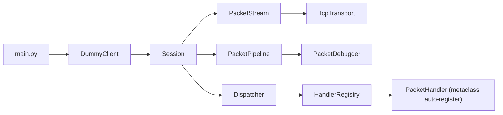

# Tibiame Bot

[](https://www.python.org/)
[](https://docs.python.org/3/library/asyncio.html)
[](https://docs.astral.sh/ruff/)
[](https://github.com/microsoft/pyright)
[](#pytest)
[](#pytest)


Cliente headless em Python para estudar e automatizar o fluxo de rede do TibiaME, com foco em:

- handshake/login assincrono
- parsing de pacotes binarios
- pipeline de middlewares
- dispatch automatico de handlers por opcode

## Status do projeto

Hoje o projeto cobre muito bem a fase de conexao e autenticacao:

- login server handshake (steps 1-4)
- redirecionamento para world server
- combo login (`msg3 + msg13`)
- handlers iniciais de resposta (erro/sucesso/login/ui packs)
- debug de payload em tempo real

## Arquitetura



## Fluxo atual de execucao

1. Conecta no endpoint de login (`44.242.62.47:9191`).
2. Envia sequencia de handshake (`3 -> 19 -> 18 -> 16`).
3. Le resposta de redirect (opcode `100`) e extrai `host:port` do world.
4. Extrai packs retornados no passo 2 (opcode `50`).
5. Reconecta no world server.
6. Envia `ClientHello` + `LoginPacket` via `ComboLoginPacket`.
7. Aguarda resposta de login e dispara handlers registrados.

## Stack

- Python 3.8+
- `asyncio` para IO nao bloqueante
- `uv` para ambiente/dependencias
- Ruff (lint/format) e Pyright (tipagem)

## Setup rapido

### 1) Instalar dependencias

```bash
uv sync
```

### 2) Rodar o bot

```bash
uv run project
```

Opcionalmente:

```bash
uv run python src/main.py
```

## Configuracao basica

Os valores de runtime estao hardcoded em [`src/main.py`](src/main.py):

- `LOGIN_HOST`
- `LOGIN_PORT`
- `WORLD_ID`
- credenciais passadas para `LoginPacket.create(...)`

Para trocar conta/servidor, ajuste esses valores antes de executar.

## Estrutura do projeto

```text
src/
  main.py
  clients/
    dummy_client.py
  core/
    infrastructure/transport/   # camada TCP
    stream/                     # framing + leitura/escrita de pacotes
    protocol/                   # Packet, ByteReader/Writer, opcodes
    packets/                    # builders de login/handshake
    pipeline/                   # cadeia de middlewares
    dispatcher/                 # roteamento por opcode
    handlers/                   # handlers auto-registrados
    network/                    # ciclo de vida async da sessao
```

## Handlers implementados

- `11` -> `LoginErrorHandler`
- `13` -> `LoginSuccessHandler` (envia `ClientReady`)
- `50` -> `ReceivePackList`
- `51` -> `UiInfoHandler`

Os handlers sao registrados automaticamente via `HandlerMeta` quando os pacotes de `core.handlers` sao importados.

## Como criar um novo handler

```python
from core.handlers.base_handler import PacketHandler
from core.network.session import Session
from core.protocol.packet import Packet


class PingHandler(PacketHandler):
    OPCODE = 20

    async def handle(self, session: Session, packet: Packet) -> None:
        print("Ping recebido:", packet.payload.hex())
```

Depois, exponha o handler no `__init__.py` do pacote para que `load_handlers()` consiga importa-lo.

## Observabilidade

`DummyClient` injeta `PacketDebugger(500)` na pipeline e imprime:

- opcode
- tamanho do payload
- hex
- preview `u8` e `u16`
- preview ASCII

Isso ajuda bastante no reverse engineering.

## Pytest

Configuracao atual em `pyproject.toml`:

- `testpaths = ["tests"]`
- `pythonpath = ["src"]`
- `addopts = "-s --color=yes --tb=short"`

Comandos uteis:

```bash
# roda toda a suite
uv run pytest

# roda em paralelo (pytest-xdist)
uv run pytest -n auto

# roda um arquivo/teste especifico com mais detalhe
uv run pytest tests/core/protocol/test_packet.py -k decode -vv
```

Estado atual:

- suite criada em `tests/`
- `45 passed`
- cobertura atual em `src`: `100%`

## Qualidade de codigo

```bash
uv run ruff check .
uv run pyright
uv run pytest
```

## Roadmap sugerido

- externalizar config (env/file) em vez de hardcode
- adicionar testes unitarios para `Packet`, `ByteReader` e handlers
- suportar reconexao automatica
- separar credenciais sensiveis do codigo fonte
- evoluir para modulos de automacao in-game

## Aviso

Este projeto e para estudo tecnico de protocolo e automacao. Verifique os termos de uso do jogo/servico antes de usar em ambiente real.

## Licenca

MIT.
